This file contains a comprehensive description of the project, including key explanations and detailed code snippets. It is a valuable resource for understanding the technical aspects and the implementation details of the project.

If you wish to gain deeper insights into the project’s goals, methodologies, and workings, we strongly recommend reading this document thoroughly. It provides the context and technical foundation necessary to fully appreciate the project’s design and operation.

1.**Brief description of coding process**
- In the process of implementing the project, we first extract the equations, then implement the equations in the code and check them in open-loop mode. Then, in case of system instability, we implement the necessary control loops to stabilize the system. Finally, the required controllers and requirements are implemented to complete the project requirements.

2.**Assumptions**
- 1) Number of components of the mixture to be separated: The mixture to be separated is binary.
- 2) Physical state of the feed: The feed enters the distillation tower in a saturated liquid state.
- 3) Insulation of the distillation tower: The distillation tower is completely insulated and there is no heat exchange with the environment. (There is no energy loss).
- 4) Efficiency of the trays: The trays of the tower are completely ideal and their efficiency is 100%.
- 5) Vapor phase retention: The vapor phase retention on each tray is ignored due to its small density compared to the liquid phase.
- 6) Molar heat of vaporization: The molar heat of vaporization of both components (binary mixture) is not equal to each other and the energy balance must be considered for each stage.
- 7) Number of equilibrium stages: This tower has N-2 equilibrium stages except for the reboiler and condenser. (Trays) is also another.
- 8) Ideal agitation of trays: The percentage composition of components at different points of a tray (equilibrium stage) is the same and the concentration does not have a geographical distribution.
- 9) Liquid phase retention: The liquid phase retention is considered variable.
- 10) Thermodynamic calculations: The relative fugacity is not constant throughout the tower and the modified Raoult's law is used to perform thermodynamic calculations.
- 11) Condenser and reboiler dynamics: The condenser and reboiler dynamics (dynamics of the upper and lower heat exchangers) are ignored.
- 12) Tower operating pressure: The pressure of this tower is not constant and the pressure drop at each stage (trays) is considered.

3.**Equations**
- Mass (total and partial) and energy balance for the condenser (stage 1):
   
- Mass (total and partial) and energy balance for all trays except the feed tray
   
- Mass (total and partial) and energy balance for the feed tray
   
- Mass (total and partial) and energy balance for the reboiler (final stage)
   
  
4.**Liquid and vapor phase enthalpy calculation equations**
   
- Enthalpy equation
   
  

  
- Cp equation
 
   

- Enthalpy of vaporization

   

5.**Liquid and vapor phase density calculation equations**

  

  
  

   
  

6.**Liquid and vapor phase flow rate calculation equations**

   - To calculate the liquid phase flow rate, we use the Francis Band equation, which is as follows:

      

      

      

   - Finally, the liquid phase flow rate is calculated from the following equation as follows:

     

   - By applying unit conversion, the final equation will be as follows:

     

   
      

   - We also use the following equation to calculate the vapor phase flow rate:

     

   - The average molecular mass is also calculated using the following equation:The average molecular mass is also calculated using the following equation:

     

7.**Equations for calculating the percentage composition of the liquid and vapor phases:**

  

   - Several equations have been proposed to calculate saturated vapor pressure, and here we will use the simplest of them, the Antoine equation. The Antoine equation is as follows:

     

   - Several relationships have been proposed to calculate the correction factor, and here we use the NRTL relationship for binary mixtures, which is as follows:
   
    

   - In the next step, we calculate the relative volatility so that we can calculate the percentage composition at each stage from the following relationships:

    
     

8.**Examination of the distillation column in open loop mode: (Model 1)**

   - The above equations are coded in the Distillation_Column_V1.m code as an open loop system.In this code, the vapor phase is assumed to be ideal and the simple Raoult equation is used for calculations.

9.**Implementation challenges and code issues:**

   - Modifying Distillation column equations in the model:
     
        - It was observed in the code that due to the complexity of the equations, the code does not provide desirable results; therefore, for convenience, we omit the energy balance equation and since the pressure of each tray is known, we use the following equation to calculate the temperature of each tray.
    

          

        - The temperatures T1 and T2 are calculated from the Antoine equation mentioned above as follows:
    
          

10.**Calculation of vapor phase flow rate for each tray:**

   - To calculate the flow rate in this case, we consider the Distillation column in a steady state:

      
      
     

     

     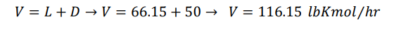

     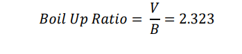

11.**Examination of the distillation column in open loop mode: (Model 2)**
   - It is related to Distillation_column_last_version.m code so for understanding please check this code in my repository.
   - Considering the responses of the system in the open-loop state, we find that the system is unstable in the open-loop state.

   - 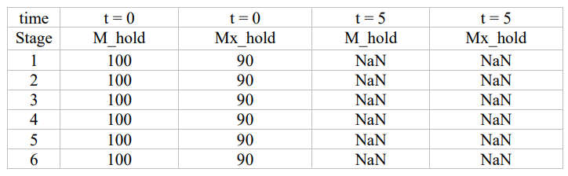

12.**Development of controllers required for column**
   - from results of previous method without controller we obtain that our system is so unsteady that leads to NAN number of data to avert this results we tune controllers to make it steady.
   - Controller for controlling liquid level in condenser and reboiler: controlled_hold_up.m
   - Controller to control the concentration of products at the top and bottom of the column: closed_loop_2.m
13.**Examination of the distillation column in open loop mode: (Model 2)**
   - Finally, after designing the controllers, we want to see their results on the Distillation column. To see these results, first the
initialization.m code must be executed to make the initial conditions for the controllers available. In the next step, we must execute the
Fnal_answer.m code to see the results of the controllers. The controller response graph is as follows.
   - 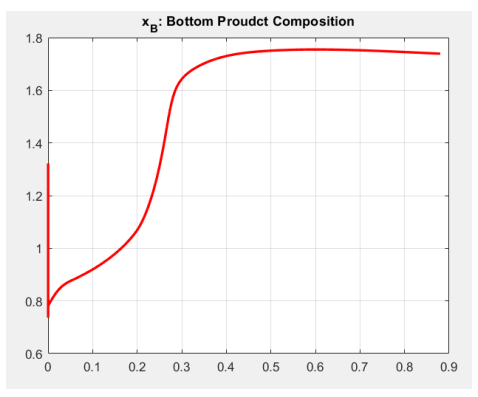     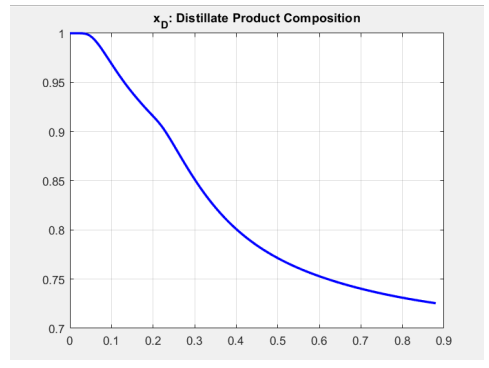

   - 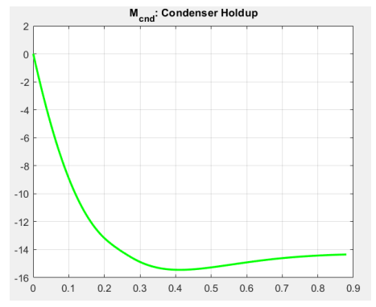     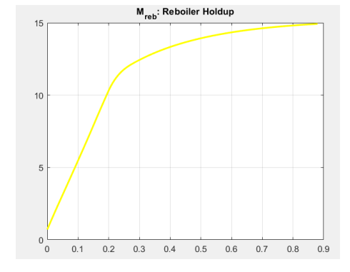

14.**Final conclusions and implementation challenges:**
   - As a result of the diagrams, we see that the controllers issue desirable control commands, but the system response is not desirable, and this can be caused by the following reasons:
       - • Divergent initial conditions for the system
       - • Having undetectable disturbances for the system
       - • Numerically calculating the integral of the proportional-integral controller
       - • Eliminating the energy balance equations of the system
       - • Applying many assumptions to simplify the system
    
15.**Introduction to ITSE and IAE controllers**
   - One of the most important parts of control systems is the design of a suitable controller. There are various types of digital controllers such as PID, PI and P controllers. In controller design, the type of disturbance detection and system error correction are the most important indicators of control design. Therefore, the selection of parameters that optimize the performance of the system is of interest to control engineers. To evaluate this issue, there are performance indicators, two of which are examined here.
   - IAE (Integral Squared Error) Optimization Method:
      - This index is calculated by integrating the squared error signal over time. The error signal is the difference between the reference input signal and the actual output signal. Mathematically, this algorithm is as follows:
      - 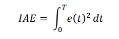
   - ITSE (Integral Time Squared Error) Optimization Method:
   - The ITSE (Integral of Time-Weighted Squared Error) optimization method is commonly used in the design of control systems to improve the performance of controllers. This method is implemented using various optimization algorithms such as genetic algorithms, gravity search algorithms, or artificial intelligence methods.
      - 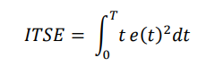
    

16.**ITSE controller for Distillation column temperature control**

   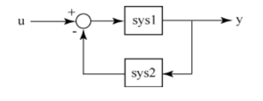

   - Results of IAE controller for Distillation column temperature control:
   - 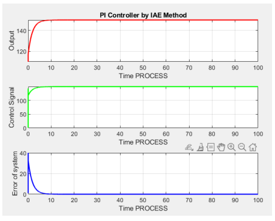

   - IAE controller for Distillation column pressure control:
   - 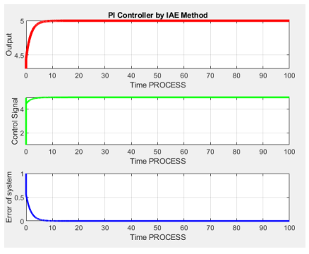
17.**Introduction to the inferential controller approach:**
     -As seen in most control systems, it is not always possible to control the output variable directly with the input variable, and this is where an approach called inferential control comes into play. According to this approach, instead of controlling a variable, we use a surrogate variable. Here the following definitions become important.
     - Controlled variables: are the set of quantities that, in the absence of a controller, change from one previous value to another over time due to changes in disturbances. These types of outputs are the most important quantities that are discussed and selected when designing a control (during coupling). The level or height of a liquid in a process vessel, the temperature of the process fluid, and the output from a heat exchanger or the temperature of a reactor are examples of controlled variables.
     - Control variables: are a set of quantities that are inputs to the process and since it is usually not possible to change or manipulate the outputs by themselves, these variables are used as a control pair of controlled variables. For example, to control the controlled variable of the temperature of a reactor, the flow rate of the coolant of the vessel jacket is used, and thus the temperature quantity is directly and explicitly coupled to the flow rate of the coolant, but is indirectly and dynamically controlled or manipulated.
In chemical engineering, the flow rate is the most common control quantity.
    - Disturbances: are a set of quantities that are input to the process but are actually an unwanted or unavoidable load. Disturbances are a set of quantities that are input to the process but are actually a load. They are not usually measured, but they must be measured in complex control combinations such as cascade control or feedforward-feedback control. In continuous processes, the main purpose and existential necessity of the controller (regulator) is to deal with these disturbances.
    - Measurable variable: Any quantity that must be measured for control or monitoring purposes.
It should be noted that some quantities can be estimated or obtained approximately. Each of the latter requires a model, and since the validity of models is limited or a relatively accurate model may not be available at all, we are forced to measure. Output variables and, secondarily, disturbances (inputs) are typically measured. Usually (but not always) the measured variables are the same as the controlled outputs, which may not be the same for reasons such as monitoring (and safety) purposes or inferential control. A well-known example of inferential control is the control of the output or effect quantity of the distillate or overhead product “concentration”. Since measuring the concentration or density online is expensive or time-consuming, the temperature of the distillate stream is measured or controlled instead, as if controlling the concentration. The reason this is successful is that we know from thermodynamics that the boiling or dew point temperature of a mixture is a function of the concentration of the components, and so we can inferentially control the temperature rather than the concentration.

18.**n-Butane Concentration Control Controller**
   - As stated in the 6th project requirement; we want to set the normal concentration of the output butane to 98% and we want to do this using the temperature of the 55th stage. To do this, the code Controller_55th_98percent.m has been developed similarly to the previous one. This code has been developed using the inferential controller approach that we explained above.
   - 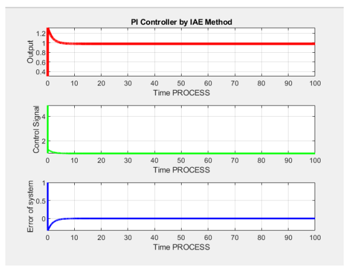

19**Final conclusion**
To run any dynamic simulation, it is first necessary to initialize the system according to the steady state conditions. It is also necessary to enter the initial conditions correctly into the system so that it does not get an incorrect response, because the distillation tower system has many undetectable disturbances. In this code, the initial values ​​are given to the distillation tower (the system of differential equations governing it) and it is expected that it can reach the equilibrium point or the steady state values ​​for the state variables starting from the steady state values. The condition for reaching the steady state is that the derivative values ​​of the state variables at the start-up moment are almost zero because the distillation tower is unstable in an open circuit and if it starts to operate from a point other than the steady state, the values ​​of the state variables go to infinity. After applying the controllers in question to the tower code, it reaches the steady state, but again, these are not our desired results because they are accompanied by numerous assumptions.
