This file contains a comprehensive description of the project, including key explanations and detailed code snippets. It is a valuable resource for understanding the technical aspects and the implementation details of the project.

If you wish to gain deeper insights into the project’s goals, methodologies, and workings, we strongly recommend reading this document thoroughly. It provides the context and technical foundation necessary to fully appreciate the project’s design and operation.

1.**Brief description of coding process**
- In the process of implementing the project, we first extract the equations, then implement the equations in the code and check them in open-loop mode. Then, in case of system instability, we implement the necessary control loops to stabilize the system. Finally, the required controllers and requirements are implemented to complete the project requirements.

2.**Assumptions**
- 1) Number of components of the mixture to be separated: The mixture to be separated is binary.
- 2) Physical state of the feed: The feed enters the distillation tower in a saturated liquid state.
- 3) Insulation of the distillation tower: The distillation tower is completely insulated and there is no heat exchange with the environment. (There is no energy loss).
- 4) Efficiency of the trays: The trays of the tower are completely ideal and their efficiency is 100%.
- 5) Vapor phase retention: The vapor phase retention on each tray is ignored due to its small density compared to the liquid phase.
- 6) Molar heat of vaporization: The molar heat of vaporization of both components (binary mixture) is not equal to each other and the energy balance must be considered for each stage.
- 7) Number of equilibrium stages: This tower has N-2 equilibrium stages except for the reboiler and condenser. (Trays) is also another.
- 8) Ideal agitation of trays: The percentage composition of components at different points of a tray (equilibrium stage) is the same and the concentration does not have a geographical distribution.
- 9) Liquid phase retention: The liquid phase retention is considered variable.
- 10) Thermodynamic calculations: The relative fugacity is not constant throughout the tower and the modified Raoult's law is used to perform thermodynamic calculations.
- 11) Condenser and reboiler dynamics: The condenser and reboiler dynamics (dynamics of the upper and lower heat exchangers) are ignored.
- 12) Tower operating pressure: The pressure of this tower is not constant and the pressure drop at each stage (trays) is considered.

3.**Equations**
- Mass (total and partial) and energy balance for the condenser (stage 1):
   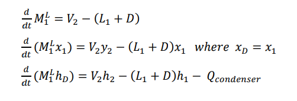
- Mass (total and partial) and energy balance for all trays except the feed tray
   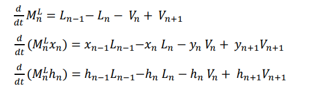
- Mass (total and partial) and energy balance for the feed tray
   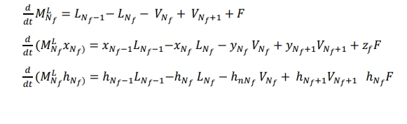
- Mass (total and partial) and energy balance for the reboiler (final stage)
   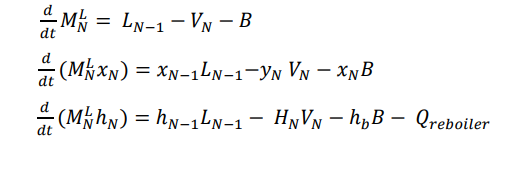
  
4.**Liquid and vapor phase enthalpy calculation equations**
   
- Enthalpy equation
   
  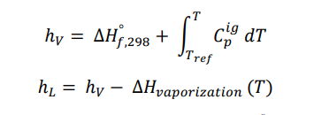

  
- Cp equation
 
   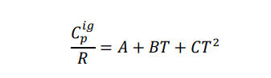

- Enthalpy of vaporization

   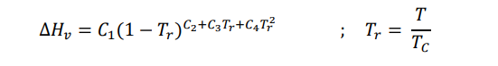

5.**Liquid and vapor phase density calculation equations**

  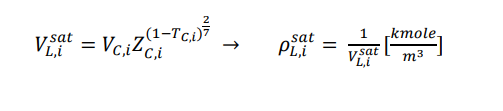

  
  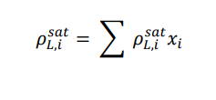

   
  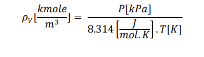

6.**Liquid and vapor phase flow rate calculation equations**

   - To calculate the liquid phase flow rate, we use the Francis Band equation, which is as follows:

      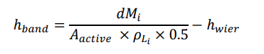

      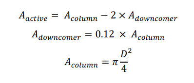

      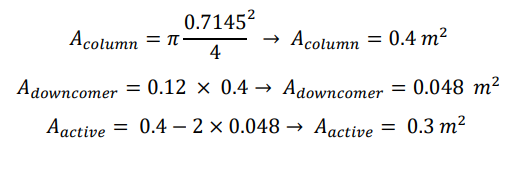

   - Finally, the liquid phase flow rate is calculated from the following equation as follows:

     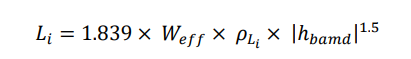

   - By applying unit conversion, the final equation will be as follows:

     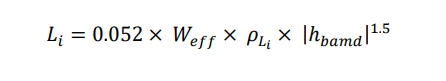

   
      

   - We also use the following equation to calculate the vapor phase flow rate:

     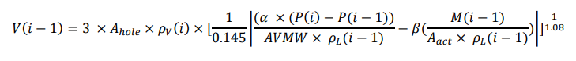

   - The average molecular mass is also calculated using the following equation:The average molecular mass is also calculated using the following equation:

     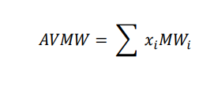

7.**Equations for calculating the percentage composition of the liquid and vapor phases:**

  

   - Several equations have been proposed to calculate saturated vapor pressure, and here we will use the simplest of them, the Antoine equation. The Antoine equation is as follows:

   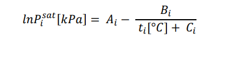  

   - Several relationships have been proposed to calculate the correction factor, and here we use the NRTL relationship for binary mixtures, which is as follows:
   
   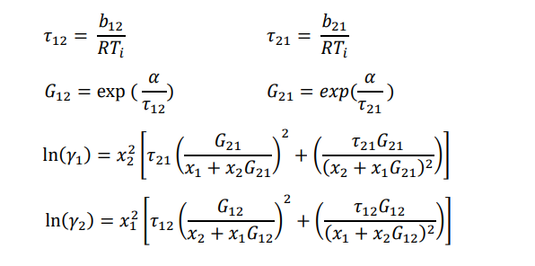 

   - In the next step, we calculate the relative volatility so that we can calculate the percentage composition at each stage from the following relationships:

   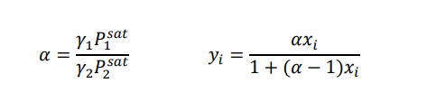 
     

8.**Examination of the distillation column in open loop mode: (Model 1)**

   - The above equations are coded in the Distillation_Column_V1.m code as an open loop system.In this code, the vapor phase is assumed to be ideal and the simple Raoult equation is used for calculations.

9.**Implementation challenges and code issues:**

   - Modifying Distillation column equations in the model:
     
        - It was observed in the code that due to the complexity of the equations, the code does not provide desirable results; therefore, for convenience, we omit the energy balance equation and since the pressure of each tray is known, we use the following equation to calculate the temperature of each tray.
    

          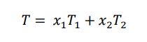

        - The temperatures T1 and T2 are calculated from the Antoine equation mentioned above as follows:
    
          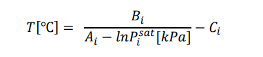

10.**Calculation of vapor phase flow rate for each tray:**

   - To calculate the flow rate in this case, we consider the Distillation column in a steady state:

     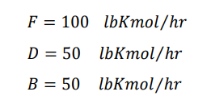 
      
     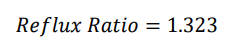

     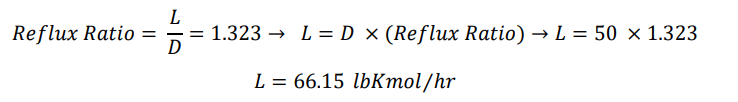
