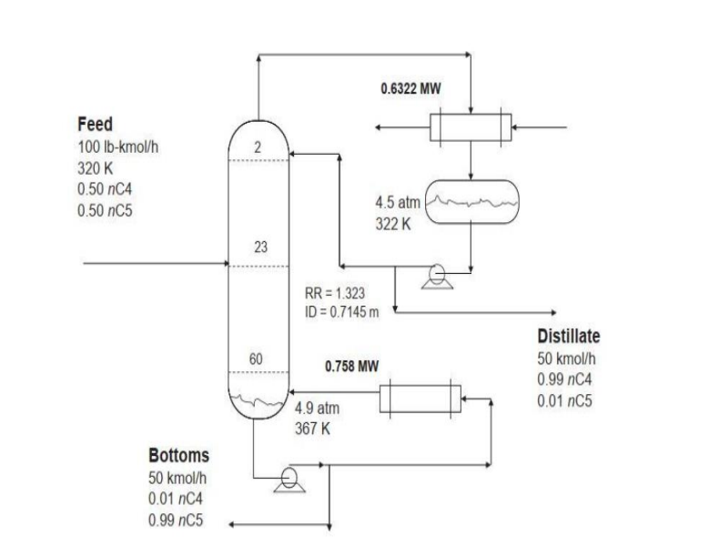

# Control-Process-Simulation
Simulation of an nC4/nC5 distillation column using MATLAB, focusing on stabilizing a non-ideal system with tuned controllers. Includes full code (some parts need improvement) and a PDF detailing goals, challenges, and comparisons to William Luyben's Simulink model. Updates planned for future versions

# Introduction
Distillation is a common separation technique for liquid streams 
containing several components and is one of the most important unit 
operations in chemical manufacturing processes. Distillation is 
designed and controlled to produce a product stream of the required 
purity, whether for sale or for use in other chemical processes. 
Distillation is based on the separation of the components of a liquid 
mixture by the difference in their boiling points. The pure component 
that boils at a lower temperature is the light component and the pure 
component that boils at a higher temperature is the heavy component.
For example, in a mixture of benzene and toluene, benzene is the light 
component and toluene is the heavy component. A saturated liquid 
mixture of the two components at a certain concentration is in 
equilibrium with the vapor phase where the concentration of the light 
component is highest relative to the liquid phase. Let x be the mole 
fraction of the light component in the liquid phase and y be the mole 
fraction of the light component in the vapor phase. For ideal mixtures, 
the phase equilibrium relationship is modeled based on relative 
Evapotranspiration by the following equation:
𝑦 =
𝛼𝑥/(1 + (𝛼 − 1)𝑥) 
where alpha represents the relative volatility. If we consider a 
conceptual design of the operation of a two-component distillation 
tower, the feed usually enters near the middle of the tower. The 
vapor flows from one stage to the next from the bottom up in the 
tower, while the liquid flows from one stage to the next from the top 
down in the tower. The vapor is condensed in the top tray and a portion 
of that liquid is refluxed back into the tower. The remaining liquid is 
removed as the product stream. The liquid leaving the bottom of the 
tower, which contains components with lower relative volatility, is also 
considered the bottom product of the tower, and the remaining liquid 
stream is vaporized through a reboiler and re-enters the tower. The 
liquid passing through each initial tray overflows and flows through a 
chute to the next tray. When the liquid moves in the cylinder, it comes 
into direct contact with the vapor passing through the holes of the 
cylinder and mass transfer occurs between the two phases. Do your 
nomenclature in such a way that the mole fraction of liquid and vapor 
leaving the first cylinder are considered as 𝑥𝑖 and 𝑦𝑖, respectively. 
Also, represent the molar flow rate of liquid and vapor leaving the 
same cylinder as 𝐿𝑖 and 𝑉𝑖 in the equations, respectively. Since the 
liquid entering this cylinder comes from the previous cylinder (the 
naming of the cylinders of the tower is considered from top to 
bottom), use 𝑥𝑖−1 and 𝐿𝑖−1 for the liquid mole fraction and its molar 
flow rate, respectively. Using a similar argument, this time for the 
next cylinder, which is the source of the vapor to the current cylinder, 
use 𝑦𝑖+1 and 𝑉𝑖+1 for its molar fraction and molar flow rate, 
respectively. Now, let's proceed to modeling the normal butane and 
normal pentane distillation towers. First, you should review the 
problem specification and the governing assumptions and equations. A 
butanizer column is considered as a sample. A mixture of 50 mol% n-butane (nC4) and 50 mol% n-pentane (nC5) is separated in a column 
with 61 equilibrium stages. The feed molar flow rate is 100 km/h and 
the feed enters the equilibrium stage 23 (the condenser is stage 1). 
The design specifications are 1 mol% pure 5nC in the distillate and 1 
mol% pure 4nC in the bottoms of the tower, which are considered as 
the desired specifications. The reflux drum pressure is set at 4.5 
atmospheres to obtain a reflux drum temperature of 322 K so that 
cooling water can be used in the condenser. Figure 1 shows the 
flowsheet with its design conditions. The column diameter is 0.7145 
m, the reflux ratio is 1.323, and the boiler heat load is 0.758 MW. The 
tray pressure drop is specified as 0.1 𝑝𝑠𝑖 at each stage. With a refluxdrum pressure of 4.5 atm and 60 𝑝 in the column, the bottom pressure
of the tower is also 4.9 atm.
You can see the overal picture of this system in the next page.

### Description about controllers
First, check how many degrees of freedom this distillation tower 
has, by setting it to zero, we can solve the equations governing the 
tower and control the tower in steady state conditions (the answer 
is 5). Now that the degrees of freedom of the distillation tower are 
equal to 5, 5 control loops are required to set it to zero. The control 
loops of the tower are:

  - Reboiler heat load control
  - Condenser heat load control
  - Distillate product control
  - Tower downflow control
  - Tower return flow control

The distillate controller regulates the composition and quality of the 
product. In many systems, this controller adjusts the reflux ratio to 
maintain the desired product purity. If the controller determines 
that the top product meets specifications or needs to reach a desired 
purity, it can increase the reflux ratio and return more liquid to the 
tower, which will separate more of the lighter components from the 
heavier ones. Similarly, the bottom product controller is responsible 
for the purity of the bottom product. This loop often adjusts the 
reboiler rate, which is the energy input to the boiler, to control the 
concentration of the heavier component in the lower sections. If the 
product is to be purer, the reboiler steam velocity is increased, 
providing more steam to carry the heavier components from the 
bottom of the tower up to the top of the tower where they can be 
effectively separated. The reflux control loop regulates the flow of 
the reboiler to the condenser. The reflux ratio, which is the rate of 
reflux of liquid to distillate, is a key variable in determining the 
efficiency and effectiveness of a tower. The reflux rate control loop 
is often tied closely to the distillation controller to meet the tower 
separation specifications. Each control loop is critical to the 
distillation process. They are usually integrated in such a way that 
changes in one loop can affect the others and require careful 
balancing and tuning by process control engineers. Advanced control 
strategies, such as multivariable control, cascade control, or model 
predictive control, may be implemented to optimize the performance 
of these loops. It is important to note that a valve must be considered 
on the feed to the tower and for the outlet streams, and its pressureflow relationship must be included in your calculations. In distillation 
towers, a temperature control strategy is usually used to control the 
quality of the products, rather than directly measuring the 
concentration of the main light and heavy components at the bottom 
and top of the tower, respectively (two-point control approach1). This 
is because not only are online concentration measurement equipment 
usually very expensive, but the measurement signal is also delayed. On 
the other hand, due to the large interaction between the control loops 
in the decentralized two-point control approach (whether based on 
temperature measurement or concentration measurement), the 
single-point temperature control approach is usually used. For this 
purpose, the temperature of one of the trays of the tower is selected 
and controlled. Various methods have been proposed for selecting the 
appropriate tray, the most common of which is selecting the tray at 
the location where the greatest change in the temperature profile of 
the tower occurs. Considering the dependence of concentration on the
Temperature,by measuring the tray temperature,Inferring the 
concentration and, in the event of disturbances, maintaining the 
concentration distribution and product quality close to the desired 
value. For this reason, this method is called the inferential control 
strategy.

## Process goals

In this project we have tried to answer following questions:

1. **First, write all the assumptions, equations and equilibrium relations 
related to the vapor and liquid phases for modeling, and then write 
the total and partial mass balance and energy balance for the 
condenser, reboiler, trays of the Rectifying and Stripping sections, 
and the feed tray.**
   

2. **check in the open loop mode whether the system reaches 
the steady state of the process or is always unstable. If it is not 
stable, consider at least the control loops to stabilize its state and 
calculate the steady values of all state variables and output 
variables and explain how to calculate them.**
    

3. **According to the investigations carried out and the sensitivity 
analysis of the temperature profile along the tower, it has been 
determined that the highest temperature change slope is related to 
the equilibrium stage 55. Now apply the mentioned control loops and 
check the system in closed circuit. Note that the controlled 
variables are the top pressure of the tower, the liquid height of the 
reflux drum, the liquid height of the sump tower, the equilibrium 
stage temperature of the 55th stage, and the feed entering the 
tower**

4. **Initially, identify the system by applying a step change and then 
design a PI controller using the ITSE and IAE methods to control 
the pressure and temperature. Then simulate the closed-loop system 
in Simulink and examine the dynamic response of the process to a 
±10% change in the setpoint of each controller and compare it with 
each other.**

5.  **Consider the system simulated in the previous step and this time 
compare the performance of the controllers to the disturbance 
rejection with a ±10% change in the feed molar flow rate, the 
normalized mole fraction of butane in the feed, and the inlet flow 
temperature, and obtain the stability limits of the controllers.**

6.**As explained in the project form, one of the control approaches is 
the output control. Now, the goal is to control the normal butane 
concentration of the output in the distillate product with this 
approach. In this way, by controlling the temperature of the 
equilibrium stage, you should keep the normal butane concentration 
of the output at 98% molar.**

## Control Strategies

The tower operation is maintained using control loops:

1. **Reboiler Heat Load Control**: Adjusts energy input for proper separation.
2. **Condenser Heat Load Control**: Ensures adequate cooling and condensation.
3. **Distillate Product Control**: Regulates product purity via reflux adjustments.
4. **Tower Downflow Control**: Balances liquid flow.
5. **Tower Return Flow Control**: Manages reflux flow.

---

## References

1. Luyben, W.L., *Process Modeling, Simulation and Control for Chemical Engineers*.  
2. Luyben, W.L., B.D. Tyreus, and M.L. Luyben, *Plantwide Process Control*.  
3. Skogestad, S., *Chemical and Energy Process Engineering*.  
4. Luyben, W.L., *Distillation Design and Control Using Aspen Simulation*.
